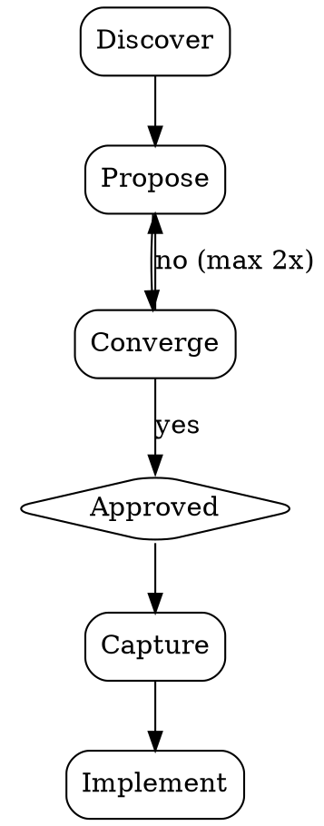

# Brainstorming

A structured but lightweight process to move from idea to actionable direction quickly. It keeps the rigor of collaborative design — exploring intent, weighing trade-offs, validating decisions — while cutting the ceremony that doesn't pay off on small and medium tasks.

The goal: understand what the user wants, think through the options together, pick a direction, and get moving. No multi-phase rituals, no mandatory design docs, no endless clarification rounds. Just enough structure to make a good decision, and nothing more.

## Ground Rules

- **No building before approval.** Do NOT write code, scaffold files, or take any implementation action until the user has explicitly approved a direction — even when the task seems obvious. The point of brainstorming is to pause and think before building. Respect that boundary.
- **Don't over-apply.** If the task is trivial, mechanical, or fully specified (typo, rename, config tweak with one right answer, or an explicit step-by-step spec), skip brainstorming and just do the work. Match the process to the stakes.

## Process Flow

- **Discover** — Assess context first: codebase, conventions, existing patterns, constraints. Then ask up to 3 focused questions (prefer multiple-choice) to clarify intent, constraints, and what success looks like. Batch related questions into one message. If the request is already clear, skip straight to Propose.
- **Propose** — Present 2–3 approaches with trade-offs. Lead with your recommendation and say why. Keep each option to a short paragraph. Scale detail to the task: a sentence or two for simple work, more reasoning for complex decisions. Where useful, note what you'd explicitly *not* do (rejected alternatives, out of scope).
- **Converge** — Get explicit approval. If rejected, revise and re-propose — max 2 rounds. If still not aligned, ask the user to state directly what they want. A good-enough direction chosen quickly beats a perfect one chosen slowly.
- **Capture** — Record the chosen direction concisely: what, why, and any key decisions or constraints. Default to a short summary in chat. If you're about to write code, put it as a brief header comment in the first file you create. Only produce a separate design doc if the user asks for one.

## Principles

- **Speed over ceremony** — The value is in the thinking, not the artifacts. Skip formality wherever it doesn't add real value.
- **YAGNI** — Design only for what's needed now. Don't add abstractions, extension points, or flexibility for requirements that don't exist yet. Handle them if and when they arrive.
- **Bias toward action** — When two options are close, pick one and go. Movement creates clarity; you'll learn more from building than from deliberating.
- **Batched discovery** — Ask clarifying questions together, not one at a time. Drawn-out discovery breaks the user's flow.
- **Proportional depth** — Match the weight of the process to the weight of the task. A small change might pass through Discover and Propose in a single message; a new subsystem deserves a fuller exploration.
- **Surface trade-offs honestly** — Name the real downside of your recommendation, not just its upsides. The user makes a better call when the costs are on the table.
