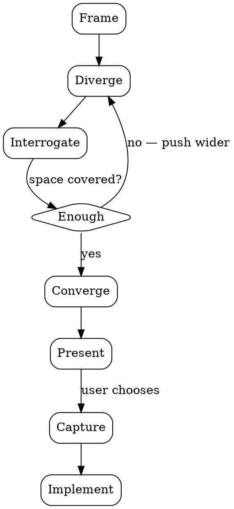

# Brainstorming

A process for finding the *right* idea, not the first workable one. It starts from the requirement, deliberately opens up the space of possible directions, interrogates each path until the weak ones collapse, and surfaces the ones that survive — reasoned through to a final form — so you can choose from genuine alternatives.

The goal is discovery: to make sure the idea you commit to is the best one you could have found, not just the first that came to mind. Breadth comes before selection. The value is in exploring paths you wouldn't have considered by default.

## Ground Rules

- **No building before approval.** Do NOT write code, scaffold files, or take any implementation action until the user has explicitly chosen a direction — even when one path seems obviously best. The point is to open the space and think before building. Respect that boundary.
- **Don't settle early.** Resist the pull toward the first decent idea. The obvious first two or three options are the starting point of exploration, not the end of it. A path is not "the answer" until it has survived interrogation against genuinely different alternatives.
- **Don't over-apply.** If the task is trivial, mechanical, or fully specified (typo, rename, config tweak with one right answer, or an explicit step-by-step spec), skip brainstorming and just do the work. Match the process to the stakes.

## Process Flow

- **Frame** — Look past the literal requirement to the underlying need. What problem is really being solved, and for whom? The right idea often requires reframing the question, so name the real objective and any hard constraints before generating anything. Ask focused questions only if a genuine ambiguity blocks exploration; otherwise start exploring — the paths themselves will surface the questions worth asking.
- **Diverge** — Generate many *genuinely different* paths from the requirement. Not variants of one idea: approaches that differ in kind — different mechanisms, different layers, different trade-off profiles, including orthogonal and deliberately non-obvious ones. Push past the first few obvious answers; the point is to cover the space, not to make a short list. Scale the count to the task, but bias toward more breadth than feels necessary.
- **Interrogate** — Pressure-test each path. What does it optimize for? Where does it break? What does it assume, and what does it cost? This is where weak ideas collapse and strong ones sharpen. An idea only earns a place among the finalists by surviving this step.
- **Converge** — Narrow to the paths that held up under interrogation and are reasoned through to a final, coherent form. Discard the rest, and note briefly why they fell away — the rejected alternatives are part of the thinking.
- **Present** — Surface the surviving paths, each stated clearly with its trade-offs, what it's best for, and where it's weak. Do NOT collapse them into a single recommendation: present the finalists honestly and let the user choose. The aim is to give a real decision between real alternatives, not to steer to one answer.
- **Capture** — Once the user chooses, record the direction concisely: what, why, and any key decisions or constraints. Default to a short summary in chat. If you're about to write code, put it as a brief header comment in the first file you create. Only produce a separate design doc if the user asks for one.

## Principles

- **Breadth before selection** — The quality of the final choice is capped by the breadth of what you explored. Open the space wide before narrowing it.
- **Reframe the problem** — The best idea often lives outside the framing of the original requirement. Question the question before answering it.
- **Diverse, not adjacent** — Value paths that differ in kind, not degree. Three variations of the same idea is one idea; the goal is genuinely distinct directions.
- **Avoid anchoring** — Don't let the first idea (yours or the user's) set the frame for the rest. Generate alternatives that would look attractive to someone who never heard the first one.
- **Interrogate honestly** — Name the real downside of every surviving path, not just its upsides. The user makes a better call when the costs are on the table.
- **No premature convergence** — Movement is not the goal; the right idea is. Don't pick a direction just to keep moving. Converge only once the space has genuinely been covered.
- **Let the user choose** — Present the finalists as real alternatives. The user decides; the process exists to make sure the choice is an informed one between the best available options.
- **Proportional depth** — Match the weight of the exploration to the weight of the task. A modest change might need only a handful of paths; a new subsystem deserves wide, deep exploration.
